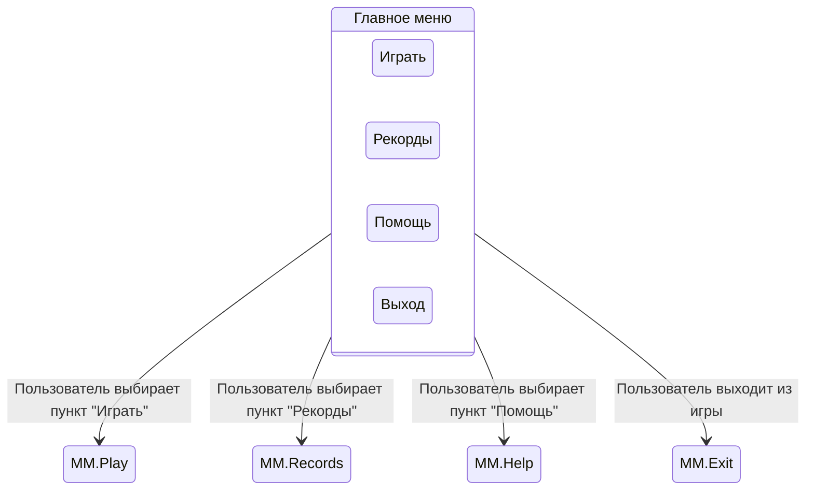
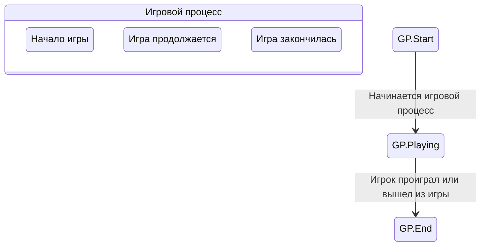
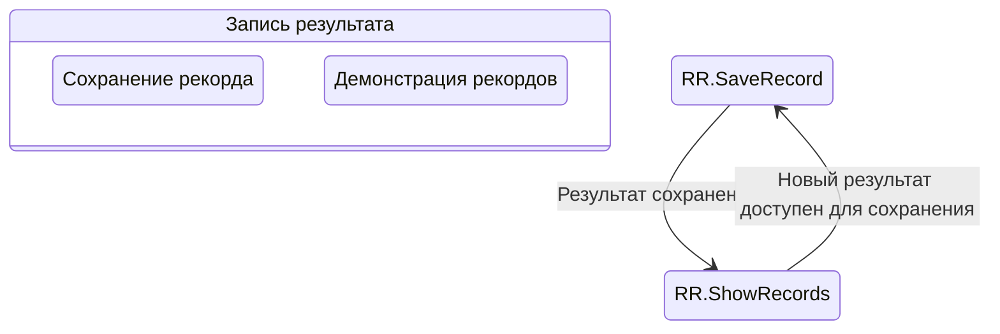
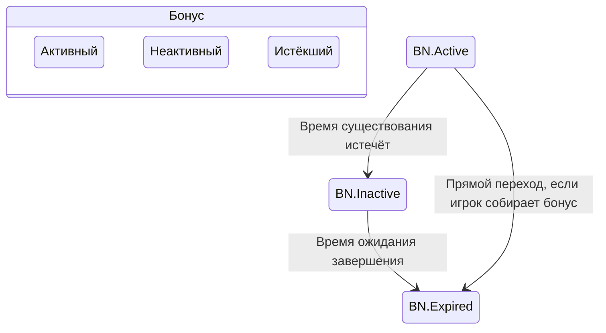
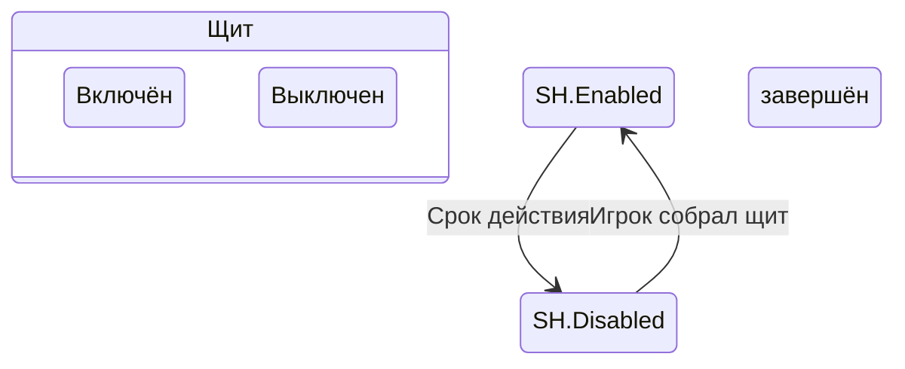
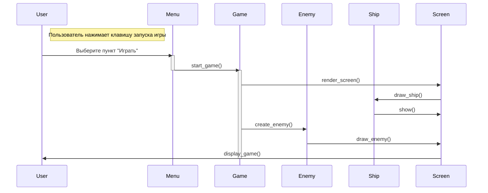

# Поведенческие модели
## Диаграмма состояний главного меню

Главный модуль показывает возможные варианты выбора пользователя в главном меню игры. Каждый выбор ведет к выполнению соответствующего действия: запуск игры, демонстрация рекордов, открытие помощи или завершение работы программы.
## Диаграмма состояний игрового процесса

Данная диаграмма отражает этапы прохождения игры: начало, активный игровой процесс и конец игры. Она помогает проследить порядок действий и возможных исходов при прохождении игры.
## Диаграмма состояний записи результата

Эта диаграмма демонстрирует процесс сохранения и демонстрации рекордов. Из нее видно, как сохраняются новые результаты и каким образом демонстрируются существующие рекорды.
## Диаграмма состояний бонусов

Эта диаграмма объясняет, как работают бонусы в процессе игры. Когда бонус появляется на экране, он находится в состоянии активного периода, пока не истечёт отведённое время. Затем бонус переходит в неактивное состояние и ожидает удаления. Если игрок соберёт бонус раньше окончания срока, он перейдёт в статус истёкшего немедленно.
## Диаграмма состояний защиты игрока (щита)

Здесь представлена работа механизма временной защиты игрока. Изначально щит отключён, и игрок уязвим. Когда игрок собирает специальный бонус, щит включается и защищает игрока на определённый период времени. После истечения указанного интервала щит снова выключается.
## Диаграмма последовательности

Последовательность шагов начинается с момента, когда пользователь выбирает пункт "Играть". Далее инициируется игра, создаются необходимые объекты (корабль, враг), осуществляется прорисовка сцены, после чего вся сцена передается обратно пользователю для отображения. Эта диаграмма хорошо демонстрирует последовательность обработки игровых событий и связь между ключевыми классами нашей программы.
