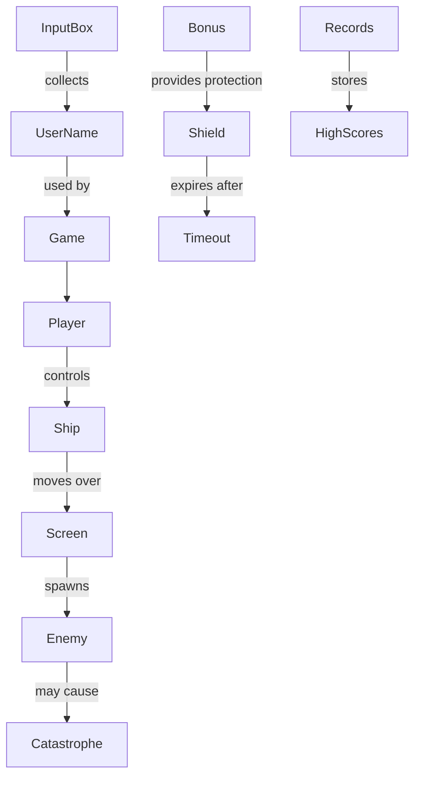

# Диаграмма классов

## Описание диаграммы классов
* Main: Главный класс, запускающий основное игровое меню и контролирующий жизненный цикл приложения.
* Menu: Класс, реализующий интерактивное меню, позволяющее выбрать уровень сложности, просмотреть рекорды и прочитать руководство.
* Game: Реализует основную логику игрового процесса, включая создание врагов, проверку столкновений и формирование итоговых результатов.
* Enemy: Представляет противников, перемещающихся по игровому полю.
* Bonus: Представляет бонусы, дающие игроку дополнительные возможности (щиты, увеличение количества жизней).
* InputBox: Компонент для сбора имени игрока при завершении игры.
* Records: Классифицирует и сохраняет игровые рекорды.

# Диаграмма объектов

## Описание диаграммы объектов
* Game: Управляет игрой, создавая персонажей и отслеживая события.
* Player: Игрок управляет кораблем и получает очки.
* Ship: Корабль движется по экрану и участвует в столкновениях.
* Enemy: Противники атакуют корабль.
* Bonus: Предлагают преимущества (щиты, жизни).
* Shield: Временная защита, истекающая через заданное время.
* InputBox: Используется для сбора имени игрока.
* Records: Хранят таблицу лучших результатов.
