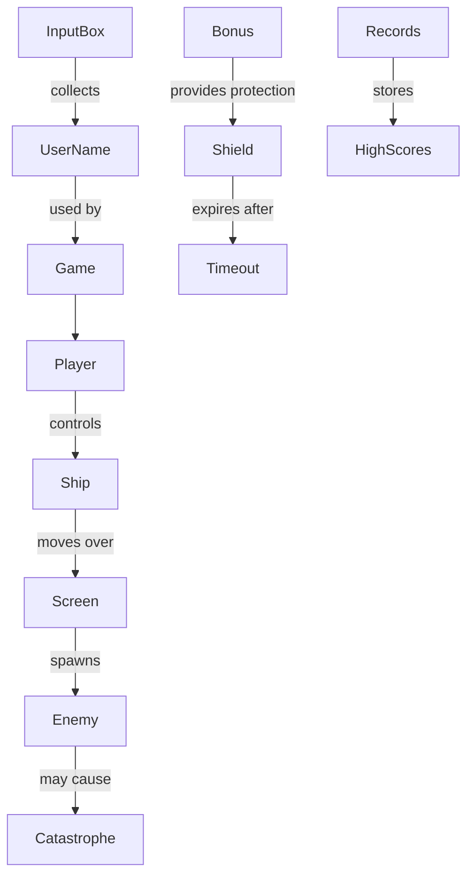

```mermaid
graph TD
    A[Game]-->B[Player]
    B-- controls -->C[Ship]
    C-- moves over -->E[Screen]
    E-- spawns -->F[Enemy]
    F-- may cause -->G[Catastrophe]
    H[Bonus]-- provides protection -->I[Shield]
    I-- expires after -->J[Timeout]
    K[InputBox]-- collects -->L[UserName]
    L-- used by -->A
    M[Records]-- stores -->N[HighScores]
```
